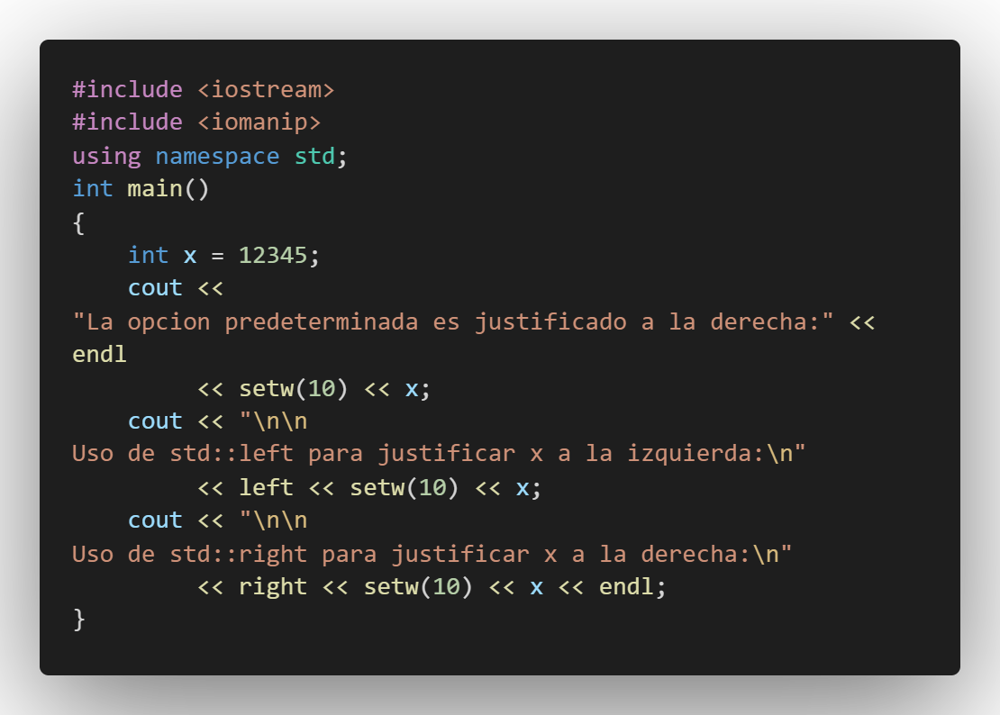
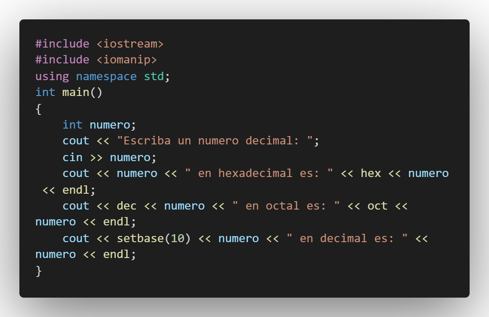

# Archivos, C++_PDC9

## :copyright: Autor

- :camera: 

- :joy: **Jamil André García Meléndez**
- :e-mail: garciajamil69@gmail.com
- :link: https://github.com/JamilGarcia/C-_PDC9
- :calendar: 2020-09-20 21:37

---

## :dart: Nota Para El Ing

    Al parecer no puedo adjuntar la salida del "AccesoAleatorio.cpp" ya que mi VSCode me tira un error
    Y creo que ese error es problema de mi VSCode, a continuacion le adjunto una captura del problema

    

---

## :black_circle: AccesoAleatorio

---

## :triangular_ruler: ArchivoBinarios

---

## :white_large_square: ArchivoClientes

## :white_medium_square: Cin Y Cin Get

---

## :large_blue_diamond: Cin getline

## :small_blue_diamond: Contacto Cpp Hpp

---

## :large_orange_diamond: CoutSetW

---
## :triangular_ruler: CoutWidth

---

## :white_large_square: DecOutHexSetbase

## :white_medium_square: EOF get y put

---

## :large_blue_diamond: hexSetw

## :small_blue_diamond: MetodosAcceso Cpp Hpp

---

## :large_orange_diamond: RaizCuadrada

---
## :large_orange_diamond: Read Y Write

---
## :large_orange_diamond: Scientific Y Fixed

---
#### Herramientas:
- :package: [Visual Studio Code](https://code.visualstudio.com/)
- :camera: [Polacode-2020 v0.5.2](https://github.com/jeff-hykin/polacode)
- :notebook: [Markdown Cheatsheet](https://github.com/adam-p/markdown-here/wiki/Markdown-Cheatsheet)
- :smile: [Emoji Cheat Sheet](https://www.webfx.com/tools/emoji-cheat-sheet/)